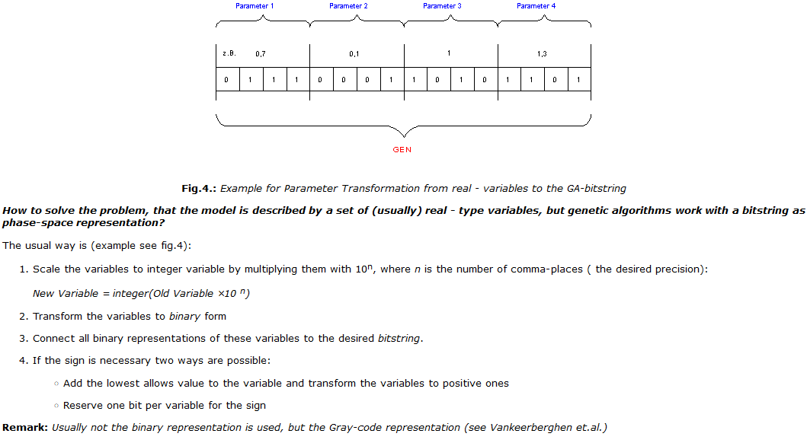
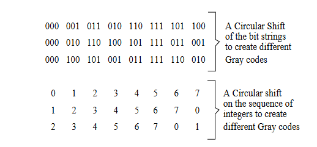
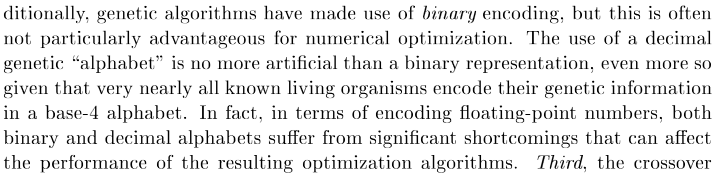

# Collection of sources on Encoding, normalization

## Literature
1. [Binary Genetic Algorithm](https://silo.tips/download/the-binary-genetic-algorithm)

Contains encoding/decoding method on p.8

2. [Compilation of GA procedure](https://web.cs.ucdavis.edu/~vemuri/classes/ecs271/Genetic%20Algorithms%20Short%20Tutorial.htm)

3. [Proceedings from Genetic and Evolutionary Computation Conference](https://link.springer.com/content/pdf/10.1007/3-540-45105-6.pdf)

Contains many works on the topic. Either default binary encoding or gray code seem to be the standard.

4. [Properties of Gray and Binary Representations](https://www.cs.bham.ac.uk/~jer/papers/gray.pdf)

5. [INTRODUCTION TO GENETIC ALGORITHMS FOR NUMERICAL OPTIMIZATION](http://cobweb.cs.uga.edu/~potter/CompIntell/no_tutorial.pdf)

Another GA approach where encoding is done in base-10

