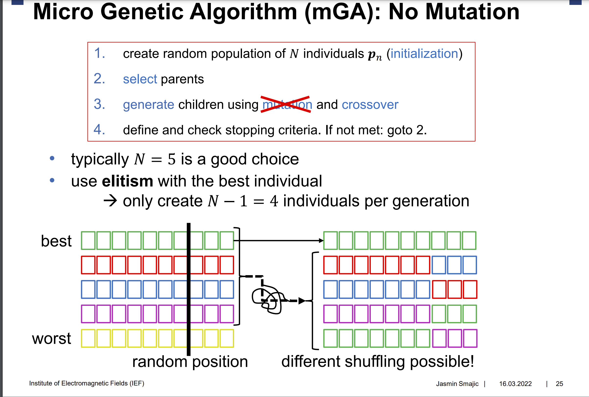

# Application-of-Pareto-Front-to-Multi-Objective-Genetic-Optimization

## TO-DO

1. Figure out how to implement shuffling with grey code with the Mga [**Hjalti**]
2. ~~Set up a class skeleton with a random start and calculate fitness functionality~~
3. ~~reate fitness function~~
4. Create an evaluate function that runs one iteration and shuffles with the mga[**Hjalti**]
5. Create a vizualuzation for fitness output i.e [**Max**]
6. Setup a library to have as a benchmark [**Max**]
7. **LONG TERM** Look into how to create a pareto front fitness function [**Lukas + Max + Hjalti**]
8. Look into other representations for shuffling other than gray code [**Lukas**]
9. Find out how to set weights, like normalization ? [**Lukas**]

## IDEAS

1. Implement micro genetic algorithm
2. Use Chankong and Haimes test func for evaluation
3. The range is [-20, 20], idea is to map small ranges in that range to binary numbers, for example with 1 bit we would have 0 as -20 and 1 as 20

