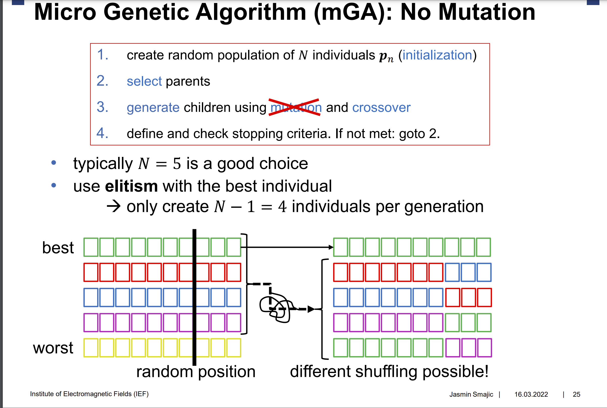

# Application of Pareto Front to Multi-Objective Genetic Optimization

## Getting Started

1. Install `poetry`
    * OSX/Linux/WSL
    ```console
    curl -sSL https://install.python-poetry.org | python3 -
    ```
    * Windows/Powershell
    ```console
    (Invoke-WebRequest -Uri https://install.python-poetry.org -UseBasicParsing).Content | python -
    ```
2. Add `poetry` to your path
    * OSX/Linux/WSL (add e.g. to .bashrc to make it permanent)
    ```console
    export PATH="$HOME/.local/bin:$PATH"
    ```
    * Windows/Powershell (add to your $profile to make permanent) or via the GUI
    ```powershell
    $env:Path += ';%APPDATA%\Python\Scripts'
    ```
3. Checkout repo 
```console
git clone https://github.com/HjaltiThrastarson/Application-of-Pareto-Front-to-Multi-Objective-Genetic-Optimization ofme
cd ofme
```
4. Create venv from lockfile and enter shell
``` console
poetry config virtualenvs.in-project true
poetry install
```
5. If you now open the folder in Visual Studio Code it should tell you that no Python Interpreter has been selected and prompt you to choose one. The recommended one should be `.venv` which is the just installed poetry environment. If not use `Ctrl+Shift+P` and change `Python: Select Interpreter` to the `.venv` in the current directory.
6. Some poetry commands
  * Add new packages/dependencies
    ```console
    poetry add <pkgname>
    ```
  * Enter the python venv
    ```console
    poetry shell
    ```
  * Update all packages
    ```console
    poetry update
    ```
7. Running Tests
```console
poetry run pytest --cov --black
```

## IDEAS

1. Implement micro genetic algorithm
2. Use Chankong and Haimes test func for evaluation
3. The range is [-20, 20], idea is to map small ranges in that range to binary numbers, for example with 1 bit we would have 0 as -20 and 1 as 20
4. Shift gray codes and restart to circumvent hamming wall. See [Procedures & Encoding](Procedures&Encoding.md)
5. Sort by fitness, if lower than threshold search area.

## First implement a mGA



## Notes on [3]

1. "Multiobjective optimization constraints are often handled by penalties that increase the objective function values in propoertion to the constraint violation."
2. Two approaches:
    1. A priori: Define weights before execution on functions to obtain utility function. Result it **a point**
    2. A posteriori: Define partial ordering on objective functions, usually Pareto order. Result is **minimal set** fulfilling the order (e.g. Pareto front)
3. Pareto dominance: y1 pareto dominates y2 if the first vector is not wores in each of the objectives and better in at least one objective than the second vector.
4. The solution of a Linear Scalarization Problem is on the Pareto front, no matter which weigths are chosen.

## Documentation

Write down any decisions you make, any problems you face and any interesting insights you come across.

* Decided for Python as programming language (due to versatility)
* Write from scratch for better learning
* Compare/Benchmark our solution with existing implementations
* First get minimum example working inkl. visualization:
    * mGA from lecture
    * Changkong/Haimes test function

## Literature
1. [Multi-Objective Optimization (Wiki)](https://en.wikipedia.org/wiki/Multi-objective_optimization)
2. [Pareto-Efficiency (Wiki)](https://en.wikipedia.org/wiki/Pareto_efficiency)
3. [A tutorial on multiobjective optimization: fundamentals and evolutionary methods](https://link.springer.com/article/10.1007/s11047-018-9685-y)
4. [Multi-objective Optimisation Using Evolutionary Algorithms: An Introduction](https://link.springer.com/chapter/10.1007/978-0-85729-652-8_1)
5. [Adaptive weighted sum method for multiobjective optimization: a new method for Pareto front generation](https://link.springer.com/article/10.1007/s00158-005-0557-6)
6. [The weighted sum method for multi-objective optimization: new insights](https://link.springer.com/article/10.1007/s00158-009-0460-7)

## Frameworks/Libraries/Resources
* [scikit-opt](https://github.com/guofei9987/scikit-opt)
* [pymoo](https://github.com/anyoptimization/pymoo) - [Corresponding Paper](https://ieeexplore.ieee.org/abstract/document/9078759)
* [Test functions for optimizations (Wikipedia)](https://en.wikipedia.org/wiki/Test_functions_for_optimization)